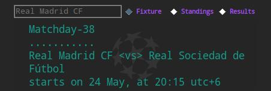

# Argon
A minimalistic football app with python tkinter

This application helps you to keep track of your favourite team's next
fixture, results and the state of the point table. Get an API key by
registering at football-data.org and you're good to go.

By default, the app will get data of Real Madrid CF at the start-up but you can
change this by editing the "default_team" option from the config.json file that
is created automatically once you enter the API key.

Covers Premier League, Championship, Bundesliga, La Liga, Ligue 1,
Seire A and Uefa Champions League.

Take caution while typing the team name, never use any nick-names such as Barca
or Wolves. Instead, try to be lexicographical- use Wolv or Barce or just Bar.
Write just Bayern or FC Bayern München, not FC Bayern Munchen.

If you get stuck with the team_name issue, check out the team_codes.json file.

